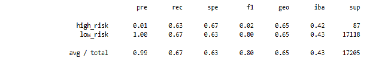
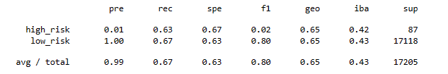
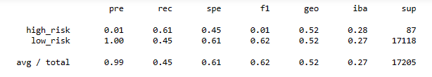
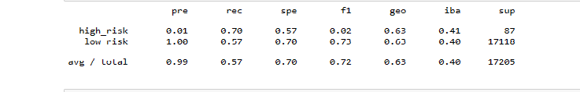
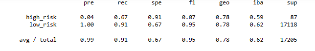
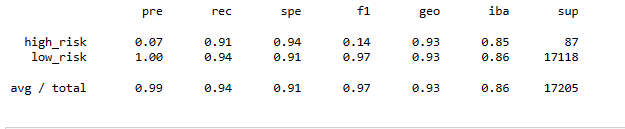

# Credit_Risk_Analysis

## Overview of the analysis: Explain the purpose of this analysis.

## Results: 

1) Naive Random Oversampling:

  
  * balanced accuracy score = 0.65
  * precision score: 1%
  * recall score: 63%

2) SMOTE Oversampling:

  * balanced accuracy score = 0.65
  * precision score: 1%
  * recall score: 63%
 
3) Cluster Centroids

  * balanced accuracy score = 0.53
  * precision score: 1%
  * recall score: 64%

4) SMOTEEN:

  * balanced accuracy score = 0.64
  * precision score:
  * recall score:

5) Balanced Random Forest Classifier

  * balanced accuracy score = 0.79
  * precision score:
  * recall score:

6) Easy Ensemble AdaBoost Classifier

  * balanced accuracy score = 0.93
  * precision score:
  * recall score:
  
